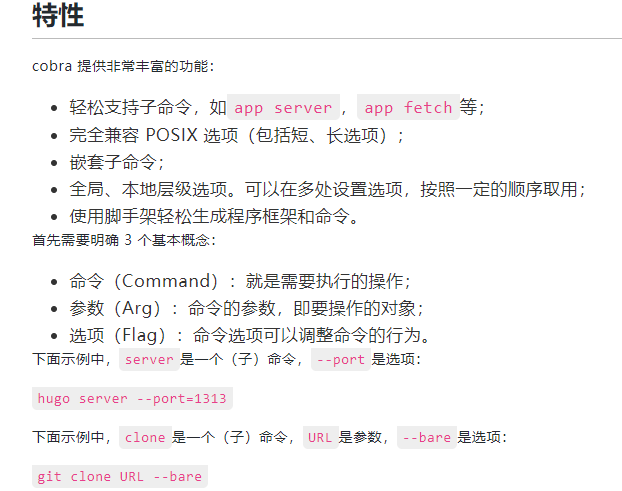

我们实现一个简单的命令行程序 git，当然这不是真的 git，只是模拟其命令行。
最终还是通过os/exec库调用外部程序执行真实的 git 命令，返回结果。所以我们的系统上要安装 git，
且 git 在可执行路径中。目前我们只添加一个子命令version。目录结构如下：

main.go文件中只是调用命令入口：

为了编码方便，在helpers.go中封装了调用外部程序和错误处理函数：

每个 cobra 程序都有一个根命令，可以给它添加任意多个子命令。我们在version.go的init函数中将子命令添加到根命令中。

编译程序。注意，不能直接go run main.go，这已经不是单文件程序了。如果强行要用，请使用go run .
$ go build -o main.exe

cobra 自动生成的帮助信息，very cool：
``` 
$ ./main.exe  -h
Git is a free and open source distributed version control system
designed to handle everything from small to very large projects
with speed and efficiency.

Usage:
  git [flags]
  git [command]

Available Commands:
  clone       Clone a repository into a new directory
  help        Help about any command
  version     version subcommand show git version info.

Flags:
  -h, --help   help for git

Use "git [command] --help" for more information about a command.

```
单个子命令的帮助信息：
``` 
$ ./main.exe  version -h
version subcommand show git version info.

Usage:
  git version [flags]

Flags:
  -h, --help   help for version

``` 
调用子命令：
``` 
$ ./main.exe  version
git version 2.31.1.windows.1
```
未识别的子命令：
``` 
$ ./main.exe clone1
Error: unknown command "clone1" for "git"

Did you mean this?
        clone

Run 'git --help' for usage.

```
使用 cobra 构建命令行时，程序的目录结构一般比较简单，推荐使用下面这种结构：
``` 
▾ appName/
   ▾ cmd/
      cmd1.go
      cmd2.go
      cmd3.go
      root.go
   main.go
```
每个命令实现一个文件，所有命令文件存放在cmd目录下。外层的main.go仅初始化 cobra.


### 特性



